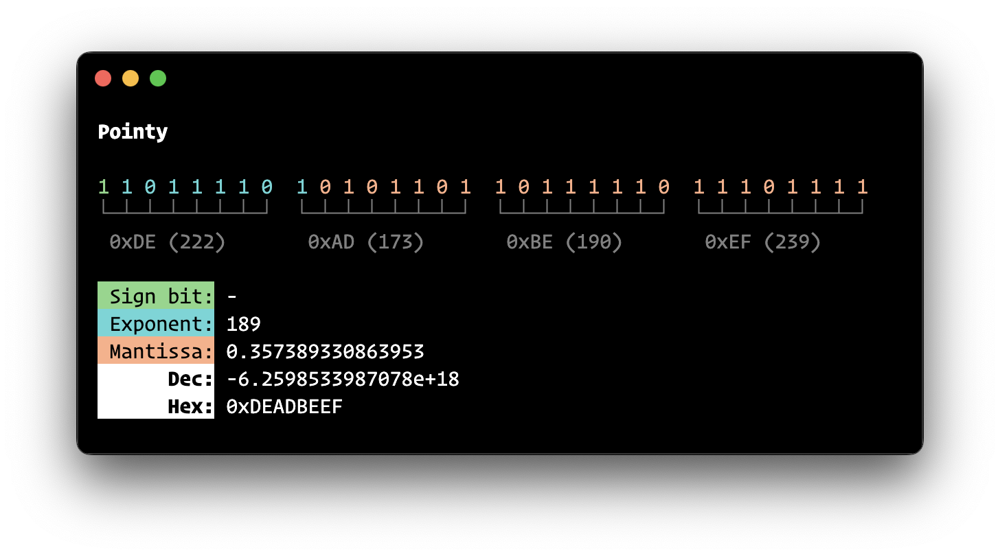

## ⇨ Pointy

### What is it?

**Pointy** is a command-line tool for visualising IEEE 754 floating point values, written in Perl.



### Installation
```
git clone https://github.com/thunderpoot/pointy.git /tmp/pointy && cp /tmp/pointy/pointy /usr/local/bin && rm -rf /tmp/pointy
```

See [How to Install CPAN Modules](http://www.cpan.org/modules/INSTALL.html) for help with installing required modules.

### Readme

```
NAME
        Pointy - Present IEEE 754 floating point values

SYNOPSIS
        # Run with no options for interactive mode
        pointy

DESCRIPTION
    Provides a visual representation of IEEE 754 floating point
    numbers.  In interactive mode the following keys are available:

        - Left / right arrow-keys to navigate bit array
        - Up / down arrow-keys to flip bits on or off
        - 1 / 0 keys to input bits manually
        - + / - keys to adjust colour index
        - Delete / backspace to set current bit to 0
        - Tab key / ^I (Control-I) to switch fields for direct input
        - ? / H key to show this help document

    Options
        [-? | -help ]
            Show this help document and quit

        [-decimal] <value>
            Present decimal <value> and quit

        [-hexadecimal] <value>
            Present hexadecimal <value> and quit

        [-nocolour]
            Do not use colours (colours are 16-bit)

        [-colour] <index>
            Adjust colour index (range: -80 to 175)

        [-unicode]
            Use Unicode characters (default is DEC Special Graphics)

        [-ascii]
            Use ASCII characters only

        [-version]
            Print current version and quit

    Examples
        # Display hex value with no colour
        pointy -n -hex deadbeef

        # Display decimal value
        pointy -d 123

BUGS
    * None known

SOURCE AVAILABILITY
    Source code is available on Github (https://github.com/thunderpoot/Pointy/)

CREDITS
    Devon (https://github.com/telnet23) for help with Perl syntax
    and mathematics

    Bartosz Ciechanowski (https://ciechanow.ski/exposing-floating-point/)
    and (https://float.exposed/)

AUTHOR
    Underwood, "<underwood@underwood.network>"

COPYRIGHT
    Copyright (c) 2023, All Rights Reserved.

    You may modify and redistribute this software only if this documentation
    remains intact.

SEE ALSO
    float(3), math(3), complex(3)

    RFC 6340 (https://www.rfc-editor.org/rfc/rfc6340.html)

STANDARDS
    Floating-point arithmetic conforms to the ISO/IEC 9899:2011 standard.

```
